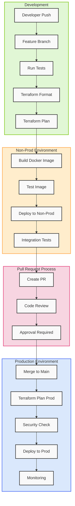

# CI/CD Pipeline Architecture

## Descripción del Pipeline

1. **Fase de Desarrollo**:
   - Push del desarrollador
   - Branch de feature
   - Tests iniciales
   - Verificación de formato Terraform
   - Plan de Terraform

2. **Ambiente Non-Prod**:
   - Build de imagen Docker
   - Tests de la imagen
   - Despliegue a non-prod
   - Tests de integración

3. **Proceso de Pull Request**:
   - Creación de PR
   - Code review
   - Aprobación requerida

4. **Ambiente de Producción**:
   - Merge a main
   - Plan de Terraform para prod
   - Verificación de seguridad
   - Despliegue a producción
   - Monitoreo

