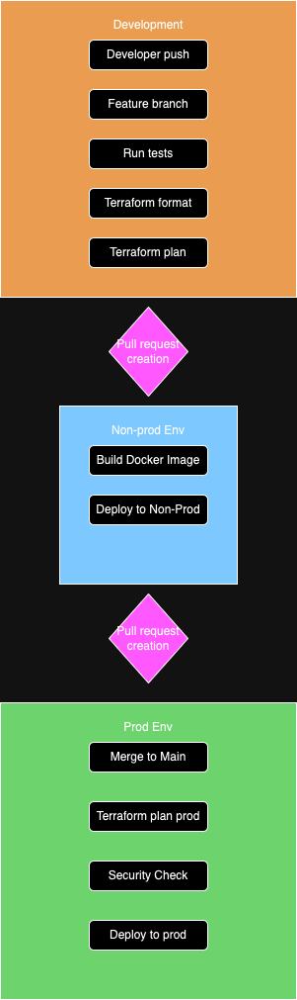

# CI/CD Pipeline Architecture

## Descripción del Pipeline

1. **Fase de Desarrollo**:
   - Push del desarrollador
   - Branch de feature
   - Tests iniciales
   - Verificación de formato Terraform
   - Plan de Terraform

2. **Proceso PR Non-Prod**:
   - Creación de PR para non-prod
   - Code review inicial
   - Aprobación para non-prod

3. **Ambiente Non-Prod**:
   - Build de imagen Docker
   - Despliegue a non-prod

4. **Proceso PR Producción**:
   - Creación de PR para prod
   - Code review exhaustivo
   - Aprobación requerida

5. **Ambiente de Producción**:
   - Merge a main
   - Plan de Terraform para prod
   - Verificación de seguridad
   - Despliegue a producción

## Using Terraform Workspaces

- **Development**: Use `terraform workspace select dev`
- **Staging**: Use `terraform workspace select staging`
- **Production**: Use `terraform workspace select prod`

Each workspace maintains its own state, ensuring isolation between environments.

