# CI/CD Pipeline Architecture

```mermaid
flowchart TD
    subgraph DEV["Development"]
        A[Developer Push] --> B[Feature Branch]
        B --> C[Run Tests]
        C --> D[Terraform Format]
        D --> E[Terraform Plan]
    end

    subgraph PR_NONPROD["Non-Prod PR Process"]
        E --> J1[Create Non-Prod PR]
        J1 --> K1[Code Review]
        K1 --> L1[Approval Required]
    end

    subgraph NONPROD["Non-Prod Environment"]
        L1 --> F[Build Docker Image]
        F --> G[Test Image]
        G --> H[Deploy to Non-Prod]
        H --> I[Integration Tests]
    end

    subgraph PR_PROD["Production PR Process"]
        I --> J2[Create Prod PR]
        J2 --> K2[Code Review]
        K2 --> L2[Approval Required]
    end

    subgraph PROD["Production Environment"]
        L2 --> M[Merge to Main]
        M --> N[Terraform Plan Prod]
        N --> O[Security Check]
        O --> P[Deploy to Prod]
        P --> Q[Monitoring]
    end

    classDef default fill:#f9f9f9,stroke:#333,stroke-width:2px;
    classDef dev fill:#e1f7d5,stroke:#82c91e,stroke-width:2px;
    classDef nonprod fill:#ffedcc,stroke:#ffa94d,stroke-width:2px;
    classDef pr fill:#f7d5e1,stroke:#e64980,stroke-width:2px;
    classDef prod fill:#dae8fc,stroke:#4c6ef5,stroke-width:2px;

    class DEV dev;
    class PR_NONPROD pr;
    class NONPROD nonprod;
    class PR_PROD pr;
    class PROD prod;
```

## Descripción del Pipeline

1. **Fase de Desarrollo**:
   - Push del desarrollador
   - Branch de feature
   - Tests iniciales
   - Verificación de formato Terraform
   - Plan de Terraform

2. **Proceso PR Non-Prod**:
   - Creación de PR para non-prod
   - Code review inicial
   - Aprobación para non-prod

3. **Ambiente Non-Prod**:
   - Build de imagen Docker
   - Tests de la imagen
   - Despliegue a non-prod
   - Tests de integración

4. **Proceso PR Producción**:
   - Creación de PR para prod
   - Code review exhaustivo
   - Aprobación requerida

5. **Ambiente de Producción**:
   - Merge a main
   - Plan de Terraform para prod
   - Verificación de seguridad
   - Despliegue a producción
   - Monitoreo

